# Creación y diseño de una aplicación web para una pizzería
**Curso Integrador I: Sistemas Software**

**Profesor:** Claudia Yolanda Villalta Flores

**Alumnos:**  
- Malek Antonio Puican Ruiz  
- Anthony Josue Laura Perez  
- Roosvelt Owen Matos Morales  
- Palomino Lugo Walter Jose Miguel  
- Julian Fernando Camacho Calle  

**Fecha:** 01 de octubre de 2024

---

## Índice
1. [Presentación de la empresa](#presentación-de-la-empresa)  
    1.1. [Misión](#misión)  
    1.2. [Visión](#visión)  
    1.3. [Entorno](#entorno)  
    1.4. [Estrategias](#estrategias)  
    1.5. [Planes de la empresa](#planes-de-la-empresa)  
2. [Descripción del problema](#descripción-del-problema)  
    2.1. [Alternativas de solución](#alternativas-de-solución)  
        2.1.1. [Solución 1](#solución-1)  
        2.1.2. [Solución 2](#solución-2)  
        2.1.3. [Solución 3](#solución-3)  
3. [Alcances](#alcances)  
4. [Requerimientos](#requerimientos)  
    4.1. [Requerimientos funcionales del sistema](#requerimientos-funcionales-del-sistema)  
    4.2. [Requerimientos no funcionales del sistema](#requerimientos-no-funcionales-del-sistema)  
5. [Lean Canvas](#lean-canvas)  
6. [Work Breakdown Structure](#work-breakdown-structure)
7. [Diagrama de procesos](Diagrama-de-procesos)
8. [MOCKUP](#mockup)
9. [Estructura de capas](#estructura-de-capas)
10. [Diagrama entidad relación](#diagrama-entidad-relacion)
11. [Modelo conceptual](#modelo-conceptual)
12. [Modelo físico](#modelo-físico)
13. [Diagrama de clases](#diagrama-de-clases)
14. [Anexos](#anexos)
15. [BPM]()
16. [Referencias bibliograficas](#referencias-bibliográficas)
   

---

## Índice de Figuras

- **Figura 1:** Pantalla principal  
- **Figura 2:** Login  
- **Figura 3:** Register  
- **Figura 4:** Primer local  
- **Figura 5:** Segundo local  
- **Figura 6:** Pantalla principal  
- **Figura 7:** Login  
- **Figura 8:** Register  
- **Figura 9:** Primer local  
- **Figura 10:** Segundo local  
- **Figura 11:** Pantalla principal  
- **Figura 12:** Login  
- **Figura 13:** Register  
- **Figura 14:** Primer local  
- **Figura 15:** Segundo local  
- **Figura 16:** Lean Canvas  
- **Figura 17:** WBS  
- **Figura 18:** Diagrama de Procesos  
- **Figura 19:** MockUp 
- **Figura 20:** Estructura de Capas
- **Figura 21:** Diagrama entidad relacion  
- **Figura 22:** Modelo conceptual  
- **Figura 23:** Modelo físico  
- **Figura 24:** Diagrama de clases  
- **Figura 25:** Diagrama de Gantt  
- **Figura 26:** Project Charter 

## Índice de Tablas

- **Tabla 1:** [RF](#tabla-1) 
- **Tabla 2:** [RNF](#tabla-2) 

---

## Presentación de la empresa
La Pizzería Donna Pizza es un negocio local con una sólida tradición en la elaboración de pizzas artesanales de alta calidad. Ubicada en el corazón del Callao, nuestra pizzería se enorgullece de ofrecer un menú variado que incluye pizzas, entrantes, ensaladas, postres y bebidas, todo preparado con ingredientes frescos y de primera categoría.

Nuestro local proporciona un ambiente acogedor y familiar, ideal para disfrutar de una comida deliciosa con amigos y familiares. A medida que avanzamos hacia el futuro, estamos comprometidos con la mejora continua de nuestros servicios, incluyendo la implementación de tecnologías que faciliten una experiencia más cómoda y satisfactoria para nuestros clientes.

### Misión
Nuestra misión en Donna Pizza es ofrecer a nuestros clientes una experiencia culinaria excepcional mediante la preparación de pizzas y otros platillos de alta calidad, elaborados con ingredientes frescos y recetas artesanales. Nos esforzamos por proporcionar un servicio al cliente amigable y eficiente en un ambiente acogedor que invite a nuestros clientes a disfrutar de momentos especiales con sus seres queridos.

### Visión
Nuestra visión es convertirnos en la pizzería de referencia en el Callao, reconocida por nuestra excelencia en la calidad de nuestros productos y la innovación en el servicio al cliente. Buscamos expandir nuestras operaciones mediante la adopción de tecnologías que mejoren la comodidad y conveniencia para nuestros clientes, mientras mantenemos un compromiso inquebrantable con la calidad y la satisfacción del cliente.

### Entorno
La Pizzería Donna Pizza opera en un entorno competitivo donde la calidad de los productos y la experiencia del cliente son clave para el éxito. La pizzería se enfrenta a la competencia de otras pizzerías locales y cadenas de restaurantes que ofrecen servicios similares. El entorno de mercado está caracterizado por una demanda creciente de conveniencia, con clientes que valoran opciones de pedidos en línea y entrega a domicilio.

### Estrategias
- **Calidad del Producto:** Mantener un enfoque constante en la calidad de nuestros ingredientes y en la preparación artesanal de nuestras pizzas.
- **Innovación en el servicio:** Implementar una aplicación web para facilitar los pedidos en línea, reservas y seguimiento de entregas.
- **Marketing Local:** Fortalecer nuestra presencia en la comunidad mediante promociones locales, eventos y colaboraciones.
- **Atención al Cliente:** Capacitar a nuestro personal para ofrecer un servicio excepcional.
- **Optimización de Operaciones:** Optimización de Operaciones: Utilizar tecnologías y herramientas de gestión para mejorar la eficiencia operativa, controlar los inventarios y analizar el rendimiento de ventas. 

           “Los sistemas de gestión de la calidad como la ISO 9001 permiten no solo garantizar la calidad de los productos, sino también mejorar continuamente los procesos operativos de las empresas agroalimentarias” (Solleiro & Pérez, 2000, p. 40). 

### Planes de la empresa
- **Desarrollo Tecnológico:** Lanzar una aplicación web que permita realizar pedidos en línea, hacer reservas y seguir el estado de entregas.
- **Expansión de Servicios:** Ampliar opciones de entrega y recogida para alcanzar a más clientes.
- **Mejora Continua del Menú:** Actualizar regularmente el menú en función de las preferencias del cliente.
- **Fortalecimiento de la Marca:** Desarrollar campañas de marketing para aumentar la visibilidad.

---

## Descripción del problema
La pizzería se encuentra en una encrucijada, enfrentando desafíos significativos que afectan tanto la satisfacción del cliente como la eficiencia operativa. La ausencia de una aplicación web que centralice las interacciones con los clientes limita la conveniencia; estos deben recurrir a métodos tradicionales, como llamadas telefónicas y visitas presenciales, lo que no solo es engorroso, sino que causa frustraciones que pueden perder clientes.  

  

Además, la gestión interna de pedidos, inventarios y reservas se torna complicada y propensa a errores, lo que afecta directamente el flujo de trabajo del personal y la calidad del servicio. Sin un sistema que automatice y organice estos procesos, la pizzería corre el riesgo de caer en la ineficiencia, lo que puede resultar en largas esperas y confusiones en las órdenes. 

 

            “La adopción de nuevas tecnologías permite a los productores agroalimentarios mejorar significativamente la calidad y cantidad de sus productos, a la vez que optimizan los procesos productivos” (Jasso, 1999, p. 120). 

  

Otro aspecto crítico es el servicio de entrega. En un mundo donde la inmediatez es clave, la falta de una plataforma que permita a los clientes realizar pedidos en línea y rastrear sus entregas genera un alto potencial de errores y retrasos. Esto no solo perjudica la experiencia del cliente, sino que también afecta la reputación del negocio, ya que las expectativas no cumplidas pueden llevar a comentarios negativos y una disminución en la lealtad del cliente. 

  

Finalmente, la experiencia de compra se ve mermada por la falta de herramientas que ayuden a los clientes a decidir qué platillo elegir. Sin opciones de personalización claras y una presentación atractiva de los productos, los clientes pueden sentirse abrumados o desinteresados, lo que aumenta el riesgo de que busquen alternativas en la competencia. Una aplicación web bien diseñada podría transformar esta experiencia, ofreciendo descripciones detalladas, opciones de personalización y sugerencias basadas en preferencias previas. 

 

            “El desarrollo de sofisticados sistemas de control de procesos, para responder a estándares globales de inocuidad y calidad, ha sido clave para la transformación tecnológica de la industria agroalimentaria en los últimos años” (Mercado, Córdova, & Testa, 2022, p. 182). 

  

En definitiva, desarrollar una plataforma integral que aborde estos desafíos no solo es una necesidad, sino la clave para llevar la pizzería al siguiente nivel, mejorando la eficiencia operativa y creando una experiencia de cliente excepcional y memorable. 

 

 
 

- Reforzamiento del problema: 

 

La Pizzería Donna Pizza se encuentra en un punto crítico donde la falta de integración tecnológica está afectando gravemente la satisfacción del cliente y la eficiencia operativa. El proceso actual, que depende de métodos tradicionales como llamadas telefónicas y visitas presenciales, genera un flujo de trabajo ineficiente, propenso a errores y con demoras significativas. Esto no solo frustra a los clientes, que buscan conveniencia y rapidez en sus interacciones, sino que también afecta al personal, que enfrenta una gestión interna caótica de pedidos, inventarios y reservas. 

Además, el servicio de entrega, pieza clave en el mundo moderno, sufre de errores y retrasos que impactan la experiencia del cliente y erosionan la reputación del negocio. La incapacidad de ofrecer una plataforma en línea donde los clientes puedan realizar pedidos, personalizar sus opciones y hacer seguimiento de las entregas coloca a la pizzería en una desventaja competitiva significativa en un entorno donde la inmediatez es clave. Sin una solución tecnológica que organice y optimice estos procesos, Donna Pizza corre el riesgo de perder clientes leales y de ser superada por competidores más ágiles y adaptados a las nuevas demandas del mercado. 

 

Finalmente, la falta de herramientas interactivas que ofrezcan a los clientes una experiencia de compra más intuitiva y personalizada debilita el potencial de ventas y deja a los clientes insatisfechos o, peor aún, inclinados a buscar alternativas en la competencia. La implementación de una aplicación web robusta no solo resolvería estos problemas, sino que también permitiría a la pizzería alcanzar un nuevo nivel de eficiencia operativa, mejorando la experiencia del cliente y, en última instancia, su competitividad en el mercado. 

 

---

## Alternativas de solución
#### Solución 1
*Figura 1* 

Pantalla principal

 

*Figura 2* 

Login  

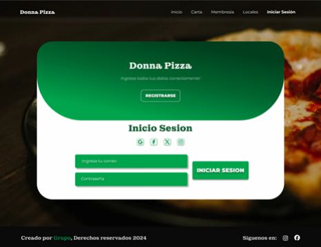

*Figura 3* 

Register  

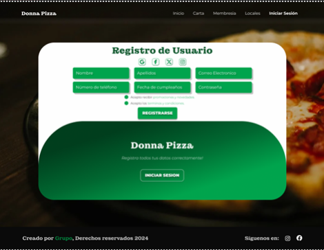

*Figura 4* 

Primer local

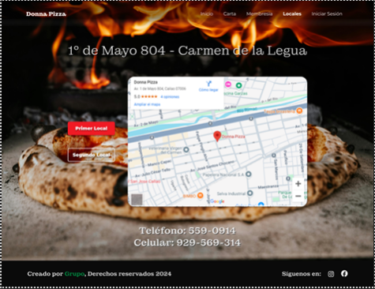

*Figura 5* 

Segundo local

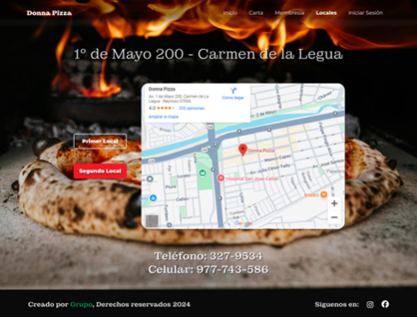

#### Solución 2

*figura 6* 

Pantalla principal

*figura 7* 

Login

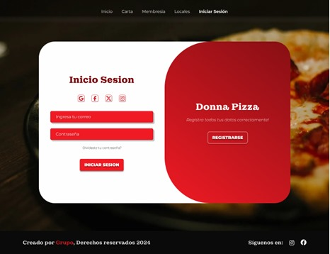

*figura 8* 

Register

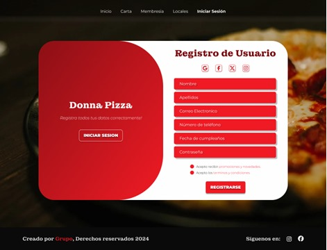

*figura 9* 

Primer local 

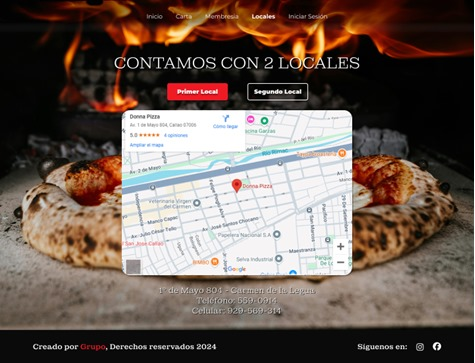

*figura 10* 

Segundo local

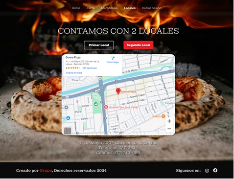

#### Solución 3

*figura 11* 

Pantalla principal

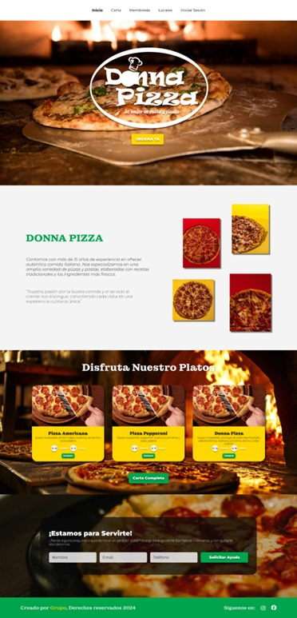

*figura 12* 

Login

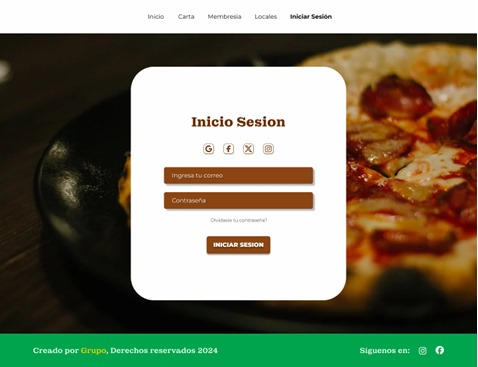

*figura 13* 

Register

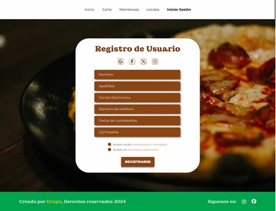

*figura 14* 

Primer local 

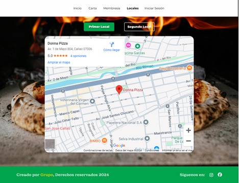

*figura 15* 

Segundo local

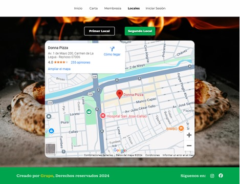

---

## Alcances
El proyecto incluye la creación de una aplicación web utilizando HTML, CSS, JavaScript y SQL. La plataforma permitirá a los clientes realizar pedidos, personalizar productos y realizar pagos en línea. Además, se implementará una interfaz de administración para gestionar inventarios, pedidos y analizar ventas.

---

## Requerimientos

### Requerimientos funcionales del sistema

 ### *tabla 1*

| Requerimientos funcionales del sistema | Descripción |
|----------------------------------------|-------------|
| **RF01** | Permite que los usuarios se registren y creen cuentas. |
| **RF02** | Permite a los administradores agregar, editar, eliminar y visualizar perfiles de usuario. |
| **RF03** | Contiene una barra de navegación que permita acceder a las diferentes secciones del sitio web. |
| **RF04** | Permite a los usuarios buscar contenido utilizando palabras clave. |
| **RF05** | Permite a los usuarios dejar consultas y reclamos. |
| **RF06** | Cifrado de las contraseñas de los usuarios. |
| **RF07** | Contiene un panel de administración donde los administradores puedan gestionar el contenido y los usuarios. |
| **RF08** | Permite a los usuarios realizar el pago a través de diferentes métodos de pago (Yape, plin, tarjetas de crédito, PayPal). |
| **RF09** | Permite a los usuarios el envío correspondiente del producto. |
| **RF10** | Permite a los usuarios agregar productos a un carrito de compras. |

### Requerimientos no funcionales del sistema

 ### *tabla 2*

| Requerimientos no funcionales del sistema | Descripción |
|-------------------------------------------|-------------|
| **RNF01** | El sistema debe ser capaz de manejar al menos 1000 usuarios concurrentes sin degradar el rendimiento. |
| **RNF02** | La arquitectura del sistema debe permitir la adición de nuevos servidores para manejar incrementos en la carga de trabajo. |
| **RNF03** | El sistema debe estar disponible el 99.9% del tiempo, excluyendo el mantenimiento programado. |
| **RNF04** | Todos los datos sensibles deben ser cifrados tanto en tránsito como en reposo. |
| **RNF05** | La interfaz de usuario debe ser intuitiva y fácil de usar, con un tiempo de aprendizaje máximo de 30 minutos para nuevos usuarios. |
| **RNF06** | El código del sistema debe seguir estándares de codificación que faciliten su mantenimiento y actualización. |
| **RNF07** | El sistema debe ser capaz de ejecutarse en diferentes sistemas operativos, incluyendo Windows, macOS y Linux. |
| **RNF08** | El sistema debe ser capaz de recuperarse automáticamente de fallos menores sin pérdida de datos. |
| **RNF09** | El sistema debe cumplir con las pautas de accesibilidad WCAG 2.1 para asegurar que sea usable por personas con discapacidades. |
| **RNF10** | El sistema debe ser compatible con los navegadores web más utilizados (Chrome, Firefox, Safari, Edge). |

---

## Lean Canvas
El Lean Canvas del proyecto presenta una estrategia clara para implementar la aplicación y mejorar la experiencia del cliente, destacando los problemas y las soluciones.

*Figura 16*

Lean Canvas

---

## Work Breakdown Structure
El WBS detalla las tareas necesarias para desarrollar la aplicación, desde el diseño inicial hasta la implementación final.

*Figura 17*

WBS

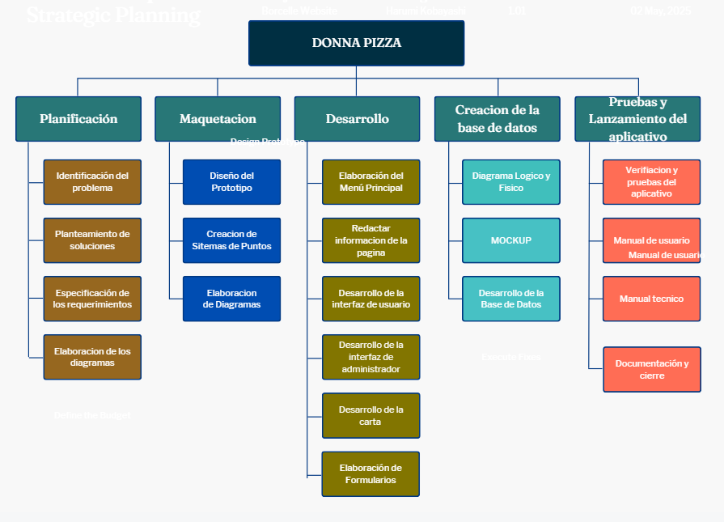

---

## MOCKUP
*Figura 18*

MOCKUP

---
## Diagrama de procesos

*Figura 19*

Diagrama de procesos

---

## Estructura de capas

*Figura 20*

Estructura de capas

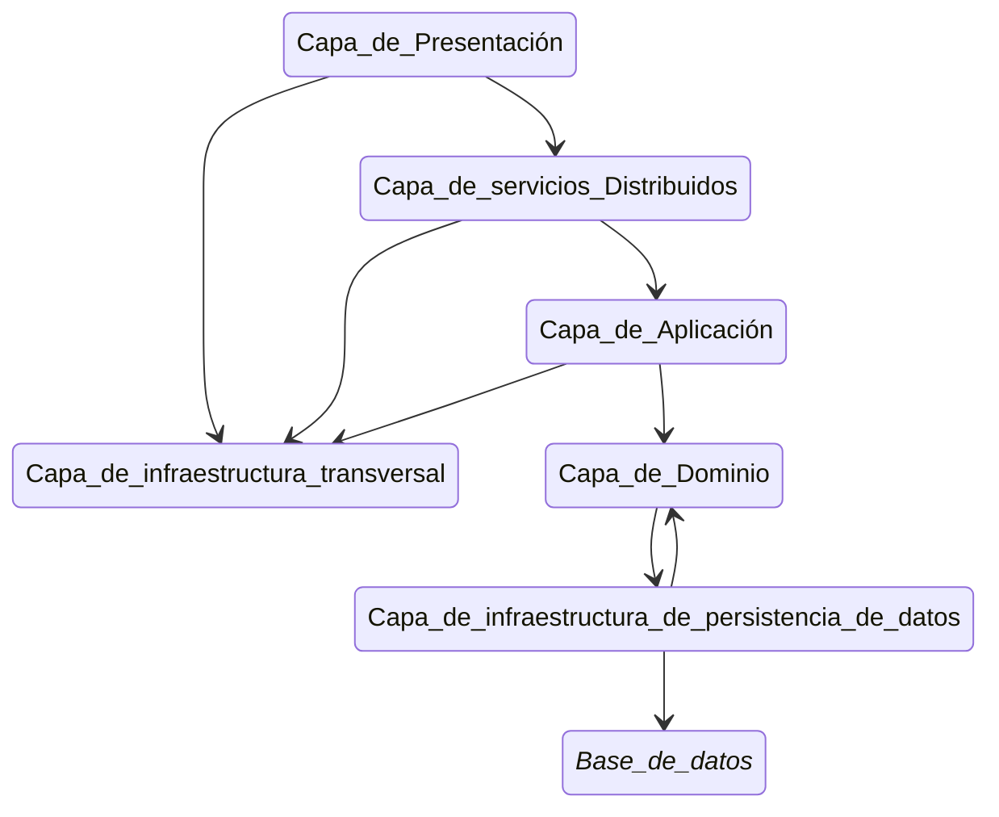

## Diagrama entidad relacion
*Figura 21*

Diagrama entidad relacion

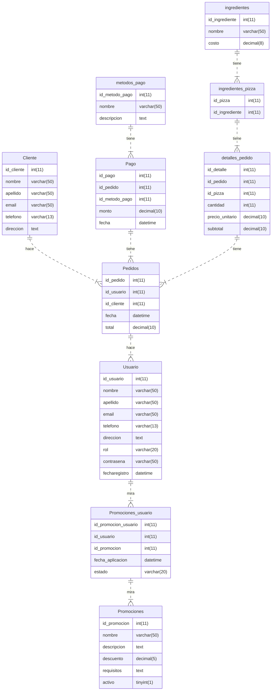
---

## Modelo conceptual

*Figura 22*

Modelo conceptual

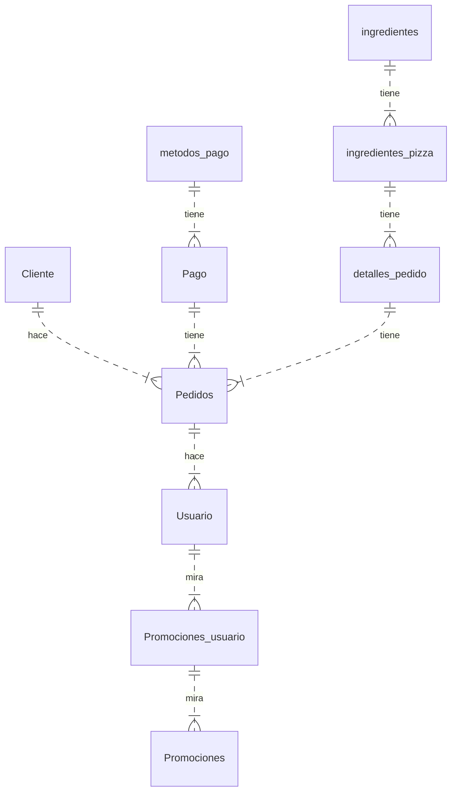
---

## Modelo físico
*Figura 23*

Modelo fisico

---

## Diagrama de clases
*Figura 24*

diagrama de clases

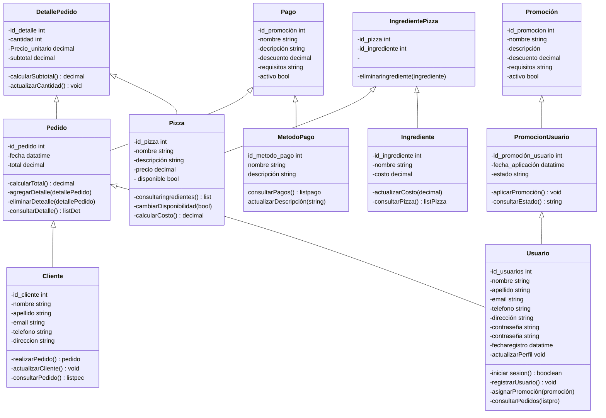

---

## Anexos

*Figura 25*

Diagrama de Gannt
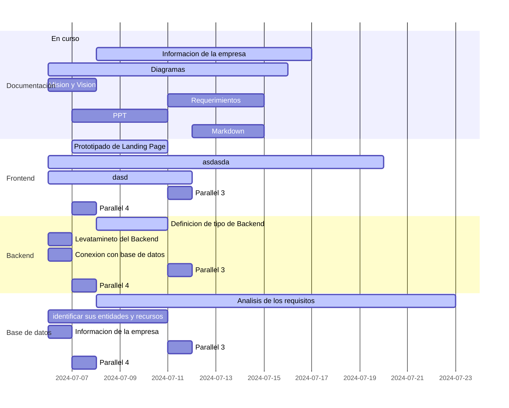
    
*Figura 26*

Project charter

## BPM

### **Definición y Documentación de Procesos**

1.    Ingresa Datos para el Registro: 

Proceso: El usuario introduce sus datos para registrarse en el sistema. 

Documentación: Define claramente los pasos y los roles involucrados en este proceso. 

2.    Inicia Sesión: 

Proceso: El usuario introduce sus credenciales y el sistema valida el acceso. 

Documentación: Define claramente los pasos y los roles involucrados en este proceso. 

3.    Selecciona Productos: 

Proceso: El usuario navega por el menú y selecciona los productos deseados. 

Documentación: Detalla cómo se presentan los productos y cómo se realiza la selección. 

4.    Recibe Productos Seleccionados: 

Proceso: El sistema confirma la selección de productos del usuario. 

Documentación: Especifica los pasos para confirmar la solicitud y cómo se maneja la aceptación del pedido. 

5.    Ingresa Información del Método de Pago: 

Proceso: El usuario introduce la información necesaria para el pago. 

Documentación: Detalla los datos requeridos y cómo se procesan. 

6.    Selecciona Modo de Pago: 

Proceso: El cliente elige el método de pago. 

Documentación: Detalla las opciones de pago disponibles y el proceso para cada una. 

7.    Pago Realizado: 

Proceso: El sistema verifica si el pago se ha realizado. 

Documentación: Define las condiciones para la aceptación del pago y las acciones a seguir si no es aceptado. 

8.    Desea Factura: 

Proceso: El sistema pregunta al cliente si desea una factura. 

Documentación: Especifica cómo se maneja la solicitud de factura y las opciones disponibles. 

9.    Genera Factura/Boleta: 

Proceso: Se genera la factura o boleta según la elección del cliente. 

Documentación: Especifica cómo se genera y se entrega la factura o boleta. 

10.    Confirmación del Pago Pedido: 

Proceso: El sistema confirma que el pedido ha sido pagado. 

Documentación: Detalla los pasos para confirmar el pago y cómo se notifica al cliente. 

11.    Recibe Pedido Cancelado o Pagado: 

Proceso: El sistema actualiza el estado del pedido según el pago. 

Documentación: Describe cómo se maneja la actualización del estado del pedido. 

12.    Entrega Pedido a Usuario: 

Proceso: El pedido es entregado al cliente. 

Documentación: Define cómo se realiza la entrega y cómo se verifica la recepción. 

13.    Usuario Recibe el Pedido: 

Proceso: El cliente recibe el pedido. 

Documentación: Especifica los pasos finales de la entrega y la confirmación de recepción. 

14.    Acción Conforme con el Pedido: 

Proceso: El cliente verifica si está conforme con el pedido. 

Documentación: Si el cliente no está conforme, se genera un informe. Si está conforme, se termina el proceso. 

### **Operación**

1.    Recopilación de Datos: 

Utiliza herramientas de software para recopilar datos sobre el rendimiento de los procesos. Esto puede incluir tiempos de preparación, tiempos de entrega, y tasas de error. 

2.    Análisis de Tendencias: 

Analiza los datos recopilados para identificar tendencias y posibles áreas de mejora. Por ejemplo, si los tiempos de entrega son consistentemente altos en ciertos días, podrías ajustar la programación del personal. 

3.    Ajustes Continuos: 

Realiza ajustes en los procesos basados en los datos y el feedback recibido. Esto puede incluir la reconfiguración de flujos de trabajo o la actualización de herramientas y tecnologías utilizadas. 

4.    Anticipación de Errores: 

Utiliza el análisis predictivo para anticipar y prevenir errores antes de que ocurran. Por ejemplo, si se prevé un aumento en la demanda, asegúrate de tener suficiente personal y stock. 

### **Mejora Progresiva e Ininterrumpida**

1.    Ciclo de Mejora Continua: 

Establece un ciclo de revisión periódica de los procesos para identificar nuevas oportunidades de mejora. Esto puede ser trimestral o semestral. 

2.    Innovación y Actualización: 

Mantente al tanto de las nuevas tecnologías y prácticas en la industria de la restauración que puedan mejorar tus procesos. Implementa estas innovaciones de manera gradual. 

3.    Feedback Constante: 

Fomenta una cultura de feedback constante entre los empleados y clientes. Utiliza encuestas y reuniones regulares para recoger sus opiniones y sugerencias. 

4.    Implementación de Mejoras: 

Basado en el feedback, implementa mejoras incrementales que mantengan los procesos eficientes y efectivos. 

## Referencias bibliográficas

Mercado, A., Córdova, K., & Testa, P. (2022). Tendencias organizativas y tecnológicas de la industria agroalimentaria global y su manifestación en Venezuela. Revista Venezolana de Nutrición, 32(2), 177-194. https://www.redalyc.org/pdf/1992/199216580007.pdf

Jasso, J. (1999). Innovaciones tecnológicas en la agricultura empresarial mexicana: Una aproximación teórica. Revista Mexicana de Agronegocios, 4(2), 112-126. https://ve.scielo.org/scielo.php?script=sci_arttext&pid=S1315-85972006000100005

Solleiro, J., & Pérez, M. (2000). Sistemas de gestión de la calidad en el sector agroalimentario. Revista Iberoamericana de Sistemas de Calidad, 10(1), 33-45. https://ve.scielo.org/scielo.php?script=sci_arttext&pid=S1316-03542004000100007
